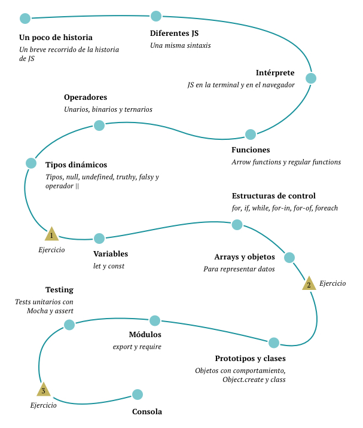

## Cómo usar este repo

— **Playground**: Aquí estarán los archivos que iré usando durante la sesión para live-coding.

— **Ejercicios/Live**: Aquí están los ejercicios que haremos durante la sesión. Estos ejercicios están divididos en directorios que iré haciendo referencia durante la sesión.

— **Ejercicios/Offline**: Aquí están los ejercicios que quedan para que practiquen luego de la sesión.


## Herramientas/dependencias

— **Git**: [Descargar Git](https://git-scm.com/downloads). _Linux y Mac ya tienen git instalado por defecto._

— **Node**: [Descargar NodeJS](https://nodejs.org/en/download/). Versión `>= 10.16.0`

— **Paquetes npm**: Correr `npm i` en la raiz de este repo para instalar las dependencias.

## Cómo clonar este repo

En una terminal, ejecutar 

```
git clone https://github.com/nicolasalliaume/js-intro.git
```

## Otros links:

— [**Tablero de preguntas**](https://www.mentimeter.com/s/bdfd2945f746ed2605c5d738e6f20e4f/7441523b3f7b)

## Contacto

Seguí la cuenta de [Instagram](https://instagram.com/nicoalliaume) donde iré publicando más material y otras sesiones como esta.

## Programa

